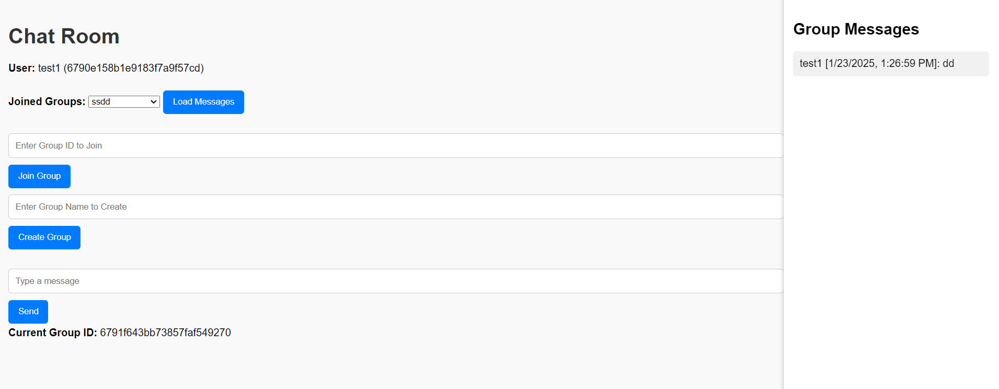
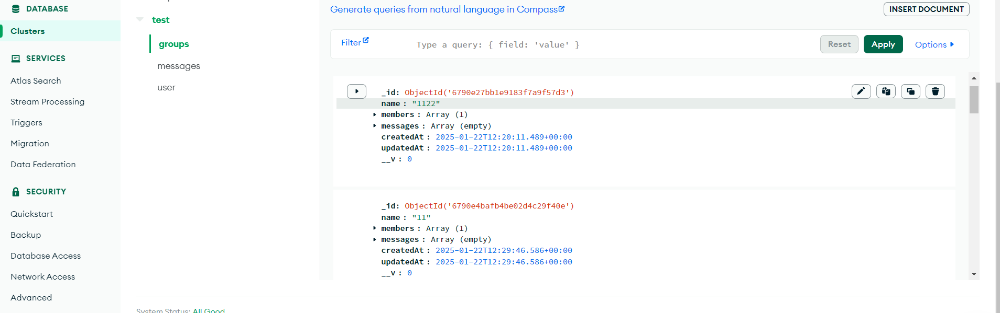

# Chat App

A real-time chat application built using Node.js, Express, and Socket.IO. This application allows users to join groups, send messages, and receive real-time updates when new messages are sent.

## Features

- User authentication (using JWT tokens)
- Create and join chat groups
- Send and receive messages in real-time
- View message history for each group

## Technologies Used

- **Frontend**: HTML, CSS, JavaScript
- **Backend**: Node.js, Express
- **WebSocket**: Socket.IO
- **Database**: MongoDB

## Screenshots




## Installation

1. **Clone the repository**:
   ```bash
   git clone https://github.com/rachitkum/chatapp_nodejs.git
   cd chatapp_nodejs

2. **Install dependencies:**:
   ```bash
   npm install

3. **.env file**:
    I have given my .env file with mongo db atlas api for testing change if required

4. **Run the application:**:
   ```bash
   npm install
